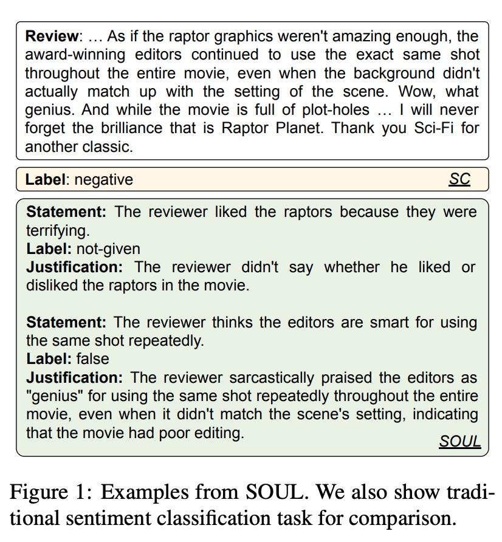
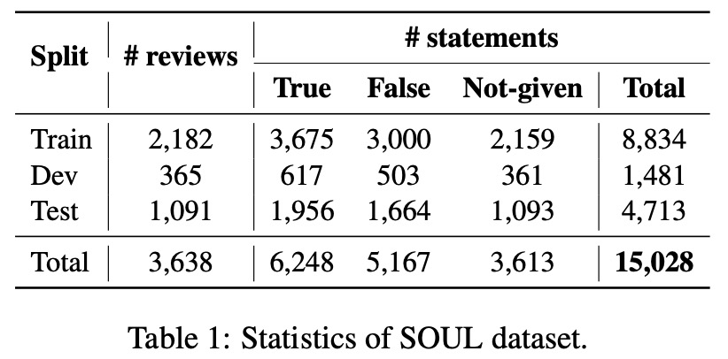
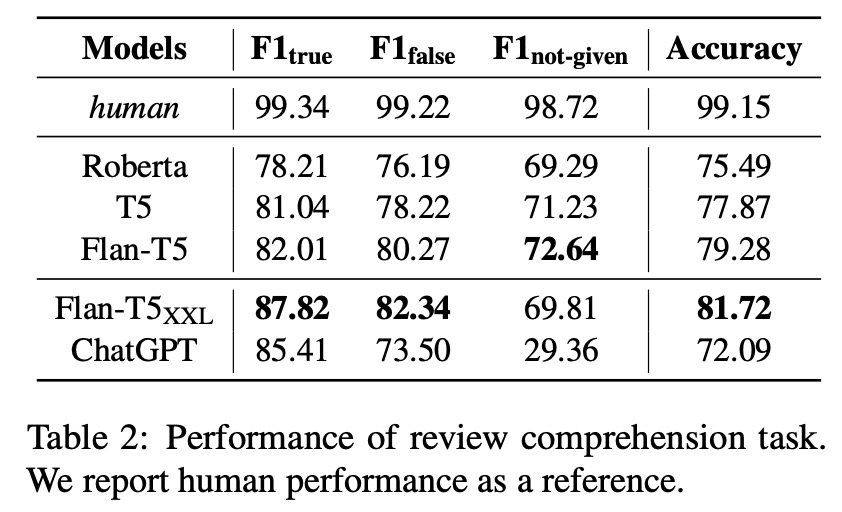
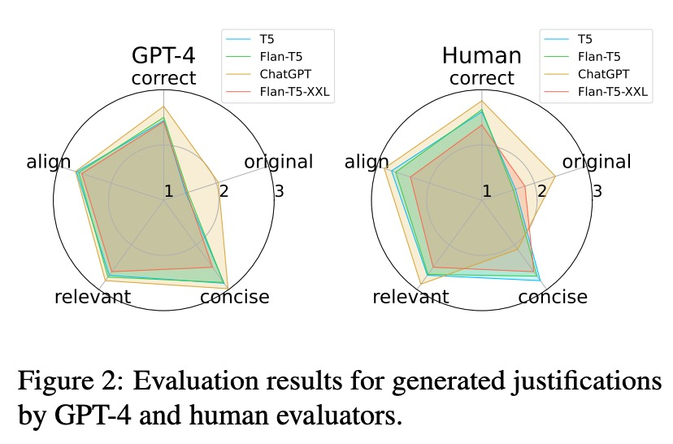

# SOUL


<p align="center" style="display: flex; flex-direction: row; justify-content: center; align-items: center">
📄 <a href="https://aclanthology.org/2023.emnlp-main.538.pdf" target="_blank" style="margin-right: 15px; margin-left: 10px">Paper</a> • 
🤗 <a href="https://huggingface.co/datasets/DAMO-NLP-SG/SOUL" target="_blank" style="margin-left: 10px">Dataset</a>
</p>
This repo contains the data for our paper "SOUL: Towards Sentiment and Opinion Understanding of Language" in EMNLP 2023.

## Usage
This repo is developed using the following packages:
```
numpy==1.21.2
openai==0.28.0
pandas==1.4.2
scikit_learn==1.1.1
tenacity==8.2.2
torch==1.13.1
tqdm==4.65.0
transformers==4.24.0
```
To run experiments on LLM and SLM:
```
bash script/run_llm.sh
bash script/run_slm.sh
```
To evaluate the result:
```
python code/evaluate.py --path YOUR_OUTPUT_FILE
```

## Introduction
Sentiment analysis is a well-established natural language processing task, with sentiment polarity classification being one of its most popular and representative tasks. However, despite the success of pre-trained language models in this area, they often fall short of capturing the broader complexities of sentiment analysis. To address this issue, we propose a new task called Sentiment and Opinion Understanding of Language (SOUL). SOUL aims to evaluate sentiment understanding through two subtasks: Review Comprehension (RC) and Justification Generation (JG).  RC seeks to validate statements based on a review text, while JG requires models to provide explanations for their sentiment predictions.
<p align="center" style="display: flex; justify-content: center; align-items: center">

</div>


## Statistics
The SOUL dataset comprises 15,028 statements related to 3,638 reviews, resulting in an average of 4.13 statements per review. To create training, development, and test sets, we split the reviews in a ratio of 6:1:3, respectively.
<p align="center" style="display: flex; justify-content: center; align-items: center">

</p>

## Results
Experimental results indicate that SOUL is a challenging task for both small and large language models, with a performance gap of up to 27% when compared to human performance.
<p align="center" style="display: flex; justify-content: center; align-items: center">

</p>

Furthermore, evaluations conducted with both human experts and GPT-4 highlight the limitations of the small language model in generating reasoning-based justifications, while also showcasing the impressive sentiment understanding capabilities of ChatGPT.
<p align="center" style="display: flex; justify-content: center; align-items: center">

</p>

## Citation
```
@inproceedings{deng-etal-2023-soul,
    title = "{SOUL}: Towards Sentiment and Opinion Understanding of Language",
    author = "Deng, Yue  and
      Zhang, Wenxuan  and
      Pan, Sinno  and
      Bing, Lidong",
    booktitle = "Proceedings of the 2023 Conference on Empirical Methods in Natural Language Processing",
    month = dec,
    year = "2023",
    address = "Singapore",
    publisher = "Association for Computational Linguistics",
    url = "https://aclanthology.org/2023.emnlp-main.538",
    pages = "8704--8711",
}
```
